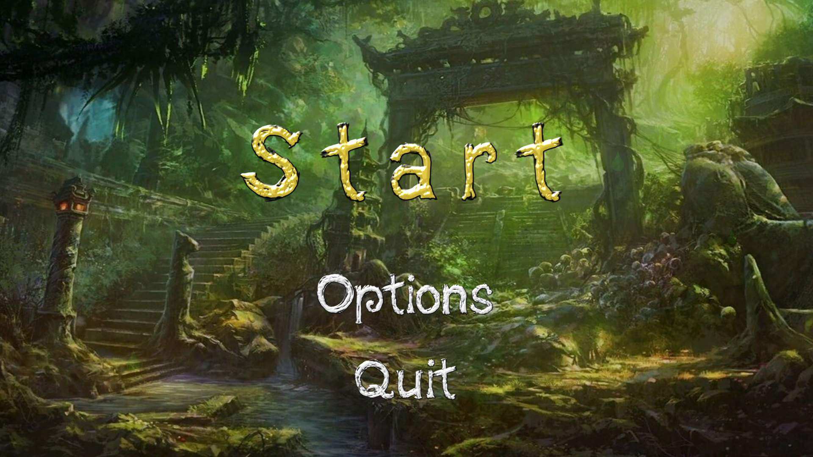
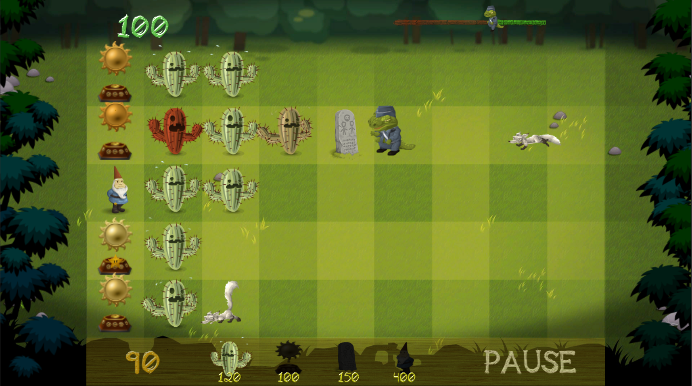

# Gardener 
Garden defender Tower Defense game. Created for learning and advancing purposes in Unity and C#.
Defend your garden from hungry animals, use variations of unique defenders and use the strategy to not let any creature harm your garden!
## Screenshots

## Tools used while developing this project
- Unity.
- Visual Studio Code. Coding in C# Programming Language.
- GitBash.
- Inno Setup Compiler (For creating installer files)
## How to install?
### For Windows User
- Open Folder Named "Game" in Space-Invader-Game repository.
- Proceed to WindowsInstaller Folder.
- Click on GardenerSetup.exe and download.
- Most probably you will face a warning message. Just Right click on warning and click "Save".
- Now you have an installer file! Open it.
- Windows Defender will prevent running it. Click "More Info" and Click "Run Anyway".
- Proceed with installing and enjoy the game!
### For Mac User
- Open Folder Named "Game" 
- Proceed to MacZIP and download zip file
- Right click on downloaded file and Open.
- Enjoy the game!
### For Android devices
- Open Folder Named "Game" and proceed to AnrdoidAPK folder
- Download Gardener.apk
- Connect your phone and drag and drop the apk file 
- Find the apk file in your phone's main files folder (My Files)
- Install the game and enjoy!
### Known bugs
- Too much enemies spawn at once.
## Contacts 
- E-mail address orkhan.elchuev@gmail.com
- https://github.com/OrkhanElchuev/Space-Invader-Game
## Aknowledgements
- [dafont](https://www.dafont.com/de/)
- [LunaPic](https://www6.lunapic.com/editor/)
- [Wallup](https://wallup.net/)
- [Freesound](https://freesound.org/)
